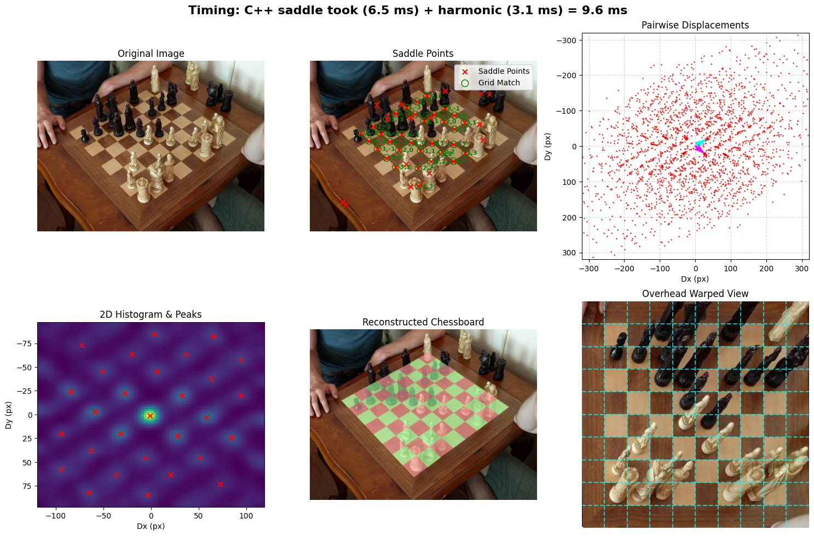
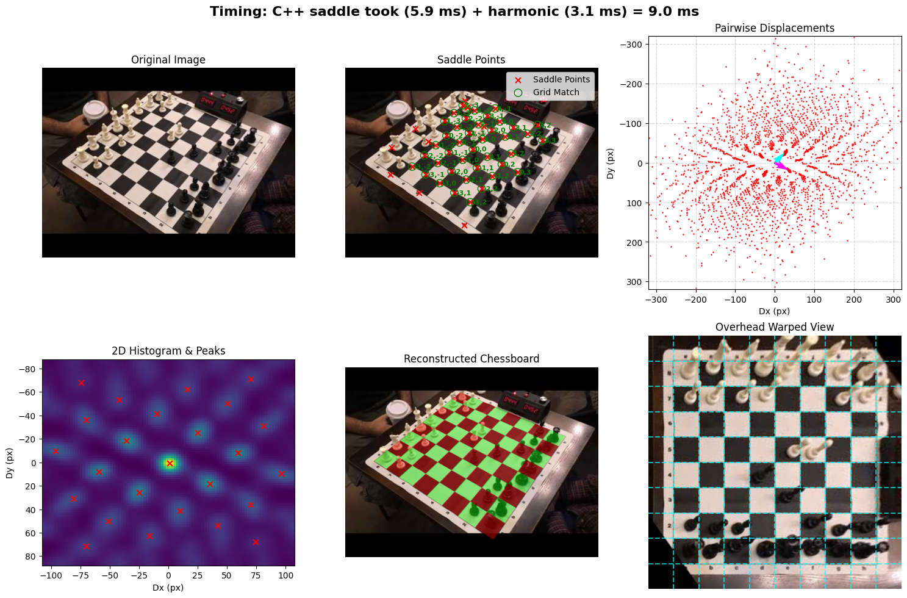
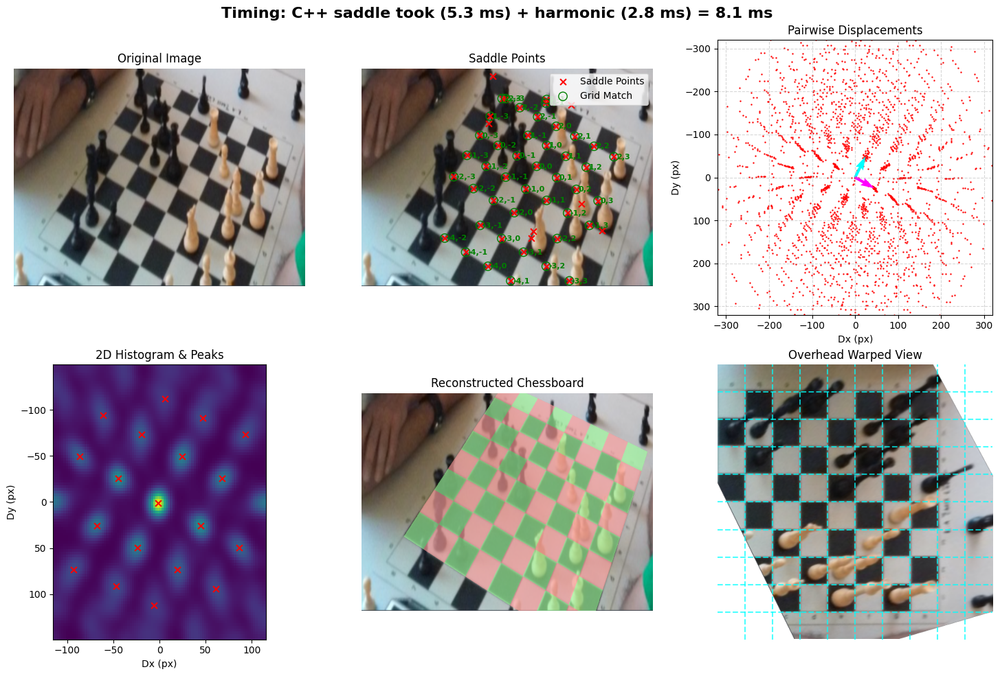
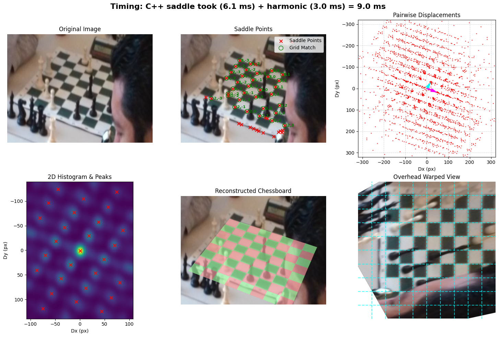

# ChessboardHarmonicDetect
Detects chessboard poses from images by locating saddle points and using harmonic analysis, runs in ~10 ms on CPU, ~1ms on GPU. 

Here is the output from the example script showing it working.




I also made a [youtube video](https://youtu.be/ikdNyfMvQsA?si=wtFThdHmDZqxIK-M) explaining how the algorithm works:

[](https://youtu.be/ikdNyfMvQsA?si=wtFThdHmDZqxIK-M)

If you use this code, please cite it as below:

    Ansari, S. (2026). ChessboardHarmonicDetect (Version 1.0.0) [Computer software]. https://github.com/Elucidation/ChessboardHarmonicDetect


This currently uses only computer vision algorithms, no machine learning. It can be greatly improved with ML to refine the points passed in.

## Solvers & Performance

We provide three different implementations of the sub-pixel saddle point detection logic to suit different hardware and latency requirements. The implementations are strictly tested to be mathematically consistent.

- **CUDA Solver (`solvers/cuda`)**: The fastest raw execution time (~0.5ms). However, it requires an NVIDIA GPU and incurs a one-time ~90ms CUDA context initialization penalty on the first run, this would be the best choice for real-time use cases.
- **C++ CPU Solver (`solvers/cpp`)**: An OpenMP multi-threaded CPU implementation. It's faster (~6ms) than the Python solver without any initialization overhead.
- **Python Solver (`solvers/python`)**: The default, highly-portable OpenCV implementation. It runs entirely in Python and takes (~16ms).

## Usage

Run the usage example to visualize the detection pipeline. You can use the `--solver` flag to benchmark the different implementations (`python`, `cpp`, `cuda`, or `all`).

Run all solvers and save to default output folders:
```bash
python usage_example.py --input input_images/3.png
```

Save to file using the C++ solver:
```bash
python usage_example.py --solver cpp --input input_images/3.png --output outputs/output_plot.png
```

## Unit Tests

We use `pytest` to ensure that our different solver implementations (Python, C++, and CUDA) remain mathematically consistent and return identical output points.

To run the unit tests:
```bash
python -m pytest -v -s tests/test_solvers.py
```

## Files

- **`solvers/`**: Directory containing the Python, C++, and CUDA implementations of the sub-pixel saddle point detection (X-corners).
- **`harmonic_solver.py`**: Estimates the 2D chessboard lattice and homography matrix from saddle points.
- **`usage_example.py`**: End-to-end usage example with matplotlib visualization.
- **`utils_visualize.py`**: Some functions to do the example matplotlib overlay.
- **`tests/test_solvers.py`**: Unit tests validating that solvers produce identical outputs despite precision differences.

## Important Functions

### `find_saddle_points(image: np.ndarray, max_pts: int = 0) -> np.ndarray`
- **Inputs**: 
  - `image` (np.ndarray): The input image array (RGB or Grayscale).
  - `max_pts` (int): Maximum number of top-scoring saddle points to return. Set to `0` to return all detected points.
- **Outputs**: 
  - `np.ndarray`: A 2D array of sub-pixel accurate `(x, y)` saddle points of shape `(N, 2)`.

### `estimate_chess_grid(lattice_points: np.ndarray) -> Tuple`
- **Inputs**: 
  - `lattice_points` (np.ndarray): The 2D array of saddle points returned by `find_saddle_points()`.
- **Outputs**: 
  - `chess_grid_points` (np.ndarray): Estimated ideal integer chess grid coordinates for each saddle point.
  - `basis_vectors` (np.ndarray): The `2x2` matrix of the estimated lattice basis vectors.
  - `debug_info` (dict): Density map and peak vectors for plotting displacements.

### `estimate_homography(lattice_points: np.ndarray, chess_grid_points: np.ndarray) -> np.ndarray`
- **Inputs**: 
  - `lattice_points` (np.ndarray): Actual saddle points in the image coordinate space.
  - `chess_grid_points` (np.ndarray): Idealized integer grid coordinates corresponding to the saddle points.
- **Outputs**: 
  - `np.ndarray`: A `3x3` homography matrix for warping between the image plane and the ideal chessboard grid, estimated via RANSAC.

## All Outputs








