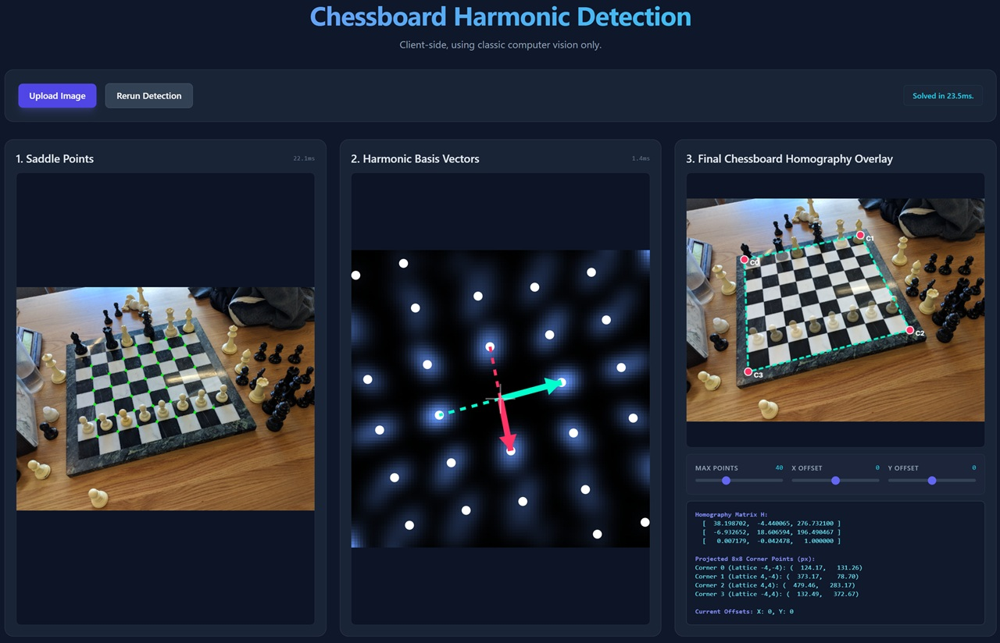
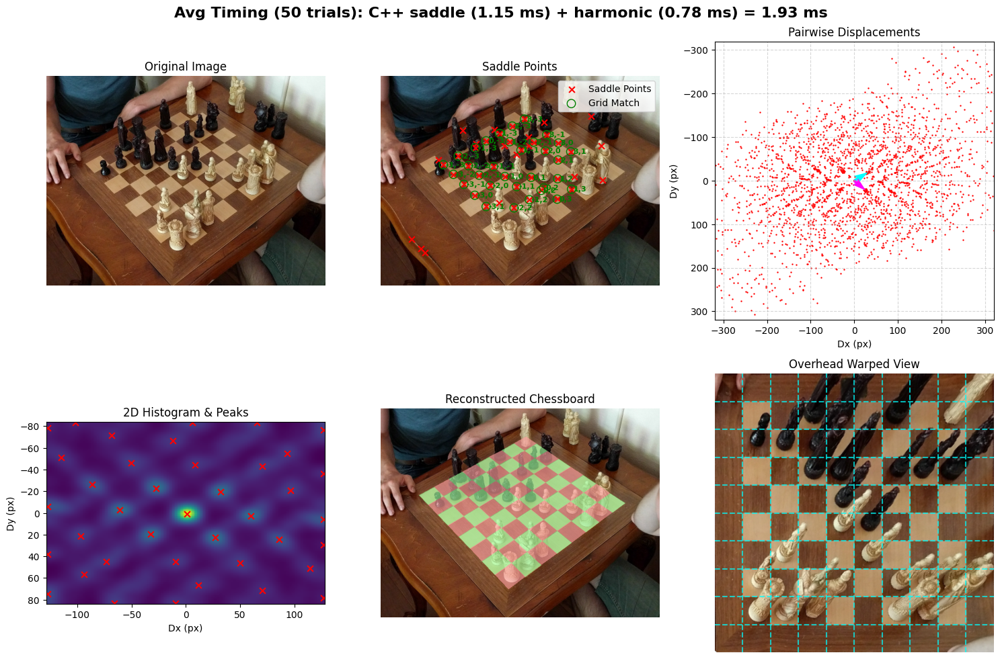
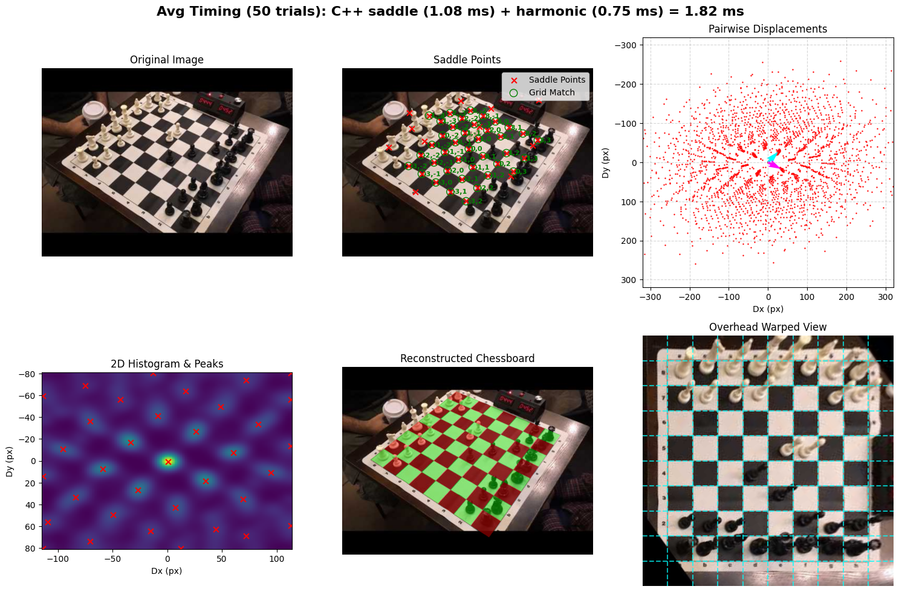
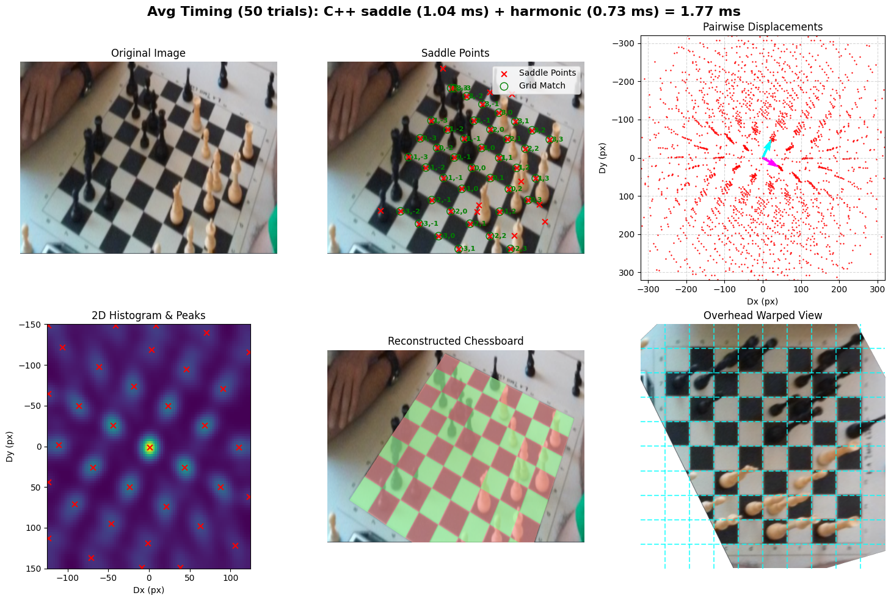
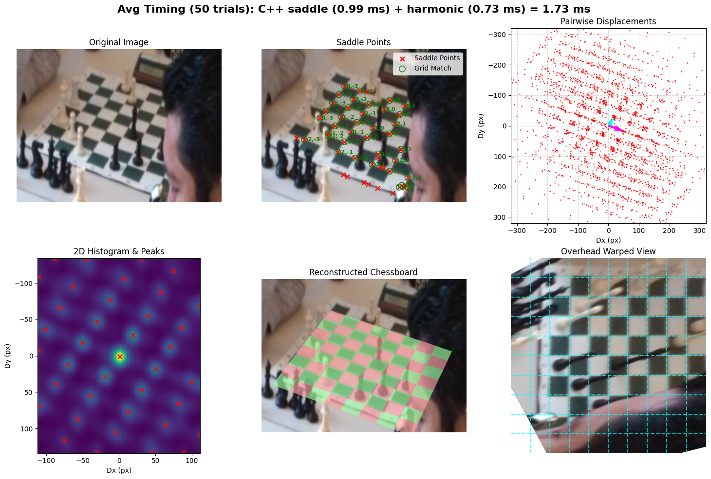

# ChessboardHarmonicDetect
Detects chessboard poses (homographies) from images via saddle point and harmonic analysis, runs in ~2 ms on CPU, faster on GPU.

If you use this code, please cite it as below:

    Ansari, S. (2026). ChessboardHarmonicDetect (Version 1.0.0) [Computer software]. https://github.com/Elucidation/ChessboardHarmonicDetect


This currently uses only computer vision algorithms, no machine learning. It can be greatly improved with ML to refine the points passed in. [ChessboardDetect](https://github.com/Elucidation/ChessboardDetect#readme) explores that approach.

---

Try it yourself with the [Web Demo](https://elucidation.github.io/ChessboardHarmonicDetect/).

[](https://elucidation.github.io/ChessboardHarmonicDetect/)

Here is the output from the [`benchmark.py`](benchmark.py) script showing it working.



I also made a [youtube video](https://youtu.be/ikdNyfMvQsA?si=wtFThdHmDZqxIK-M) explaining how the algorithm works:

[](https://youtu.be/ikdNyfMvQsA?si=wtFThdHmDZqxIK-M)


## Solvers & Performance

There are three different implementations of the sub-pixel saddle point detection logic to suit different hardware and latency requirements. The implementations are strictly tested to be mathematically consistent.

```
CUDA init took 99.5 ms. NOTE: One-time initialization cost.
C++ init took 7.3 ms. NOTE: One-time initialization cost.
...
========================================
BENCHMARK SUMMARY (50 trials, randomized order)
========================================
CUDA    : Saddle   0.49 ms (±0.06) | Harmonic  0.70 ms | Total   1.19 ms
C++     : Saddle   1.08 ms (±0.20) | Harmonic  0.75 ms | Total   1.82 ms
Python  : Saddle  16.04 ms (±0.31) | Harmonic  0.72 ms | Total  16.76 ms
========================================
```

- **CUDA Solver (`solvers/cuda`)**: The fastest raw execution time (~0.5ms). However, it requires an NVIDIA GPU and incurs a one-time ~100ms CUDA context initialization penalty on the first run, this would be the best choice for real-time use cases.
- **C++ CPU Solver (`solvers/cpp`)**: An OpenMP multi-threaded CPU implementation. It's faster (~ms) than the Python solver with lower initialization overhead.
- **Python Solver (`solvers/python`)**: The default, highly-portable OpenCV implementation. It runs entirely in Python (besides using OpenCV) and takes (~17ms).
- **WebGPU Solver (`web/`)**: A purely client-side browser implementation that uses custom `WGSL` compute shaders for saddle detection and a JavaScript port of the harmonic solver. It achieves high performance natively in the browser without any server backend.

## Web Application

This is a self-contained HTML web application that runs the entire detection pipeline in your browser client-side using WebGPU for saddle detection and Javascript for the harmonic solver.

- Serve the `web_standalone` folder: `python -m http.server 8000`
- Open `http://localhost:8000/chessboard_detect.html`

Run the usage example to visualize the detection pipeline. You can use the `--solver` flag to benchmark the different implementations (`python`, `cpp`, `cuda`, or `all`).

### Simple Example
If you just want to run the detection on a single image using the Python solver:
```bash
python usage_example.py
```

### Benchmarking Example
To run all solvers and compare performance:

Run all solvers and save to default output folders:
```bash
python benchmark.py --input input_images/3.png
```

Save to file using the C++ solver:
```bash
python benchmark.py --solver cpp --input input_images/3.png --output outputs/output_plot.png
```

## Unit Tests

We use `pytest` to ensure that our different solver implementations (Python, C++, and CUDA) remain mathematically consistent and return identical output points.

To run the unit tests:
```bash
python -m pytest -v -s tests/test_solvers.py
```

## Files

- **`solvers/`**: Directory containing the Python, C++, and CUDA implementations of the sub-pixel saddle point detection (X-corners).
- **`harmonic_solver.py`**: Estimates the 2D chessboard lattice and homography matrix from saddle points.
- **`usage_example.py`**: A clean, easy-to-read example of the core detection pipeline.
- **`benchmark.py`**: A comprehensive benchmarking and visualization script for all solvers.
- **`utils_visualize.py`**: Some functions to do the example matplotlib overlay.
- **`tests/test_solvers.py`**: Unit tests validating that solvers produce identical outputs despite precision differences.

## Important Functions

### `find_saddle_points(image: np.ndarray, max_pts: int = 0) -> np.ndarray`
- **Inputs**: 
  - `image` (np.ndarray): The input image array (RGB or Grayscale).
  - `max_pts` (int): Maximum number of top-scoring saddle points to return. Set to `0` to return all detected points.
- **Outputs**: 
  - `np.ndarray`: A 2D array of sub-pixel accurate `(x, y)` saddle points of shape `(N, 2)`.

### `estimate_chess_grid(lattice_points: np.ndarray) -> Tuple`
- **Inputs**: 
  - `lattice_points` (np.ndarray): The 2D array of saddle points returned by `find_saddle_points()`.
- **Outputs**: 
  - `chess_grid_points` (np.ndarray): Estimated ideal integer chess grid coordinates for each saddle point.
  - `basis_vectors` (np.ndarray): The `2x2` matrix of the estimated lattice basis vectors.
  - `debug_info` (dict): Density map and peak vectors for plotting displacements.

### `estimate_homography(lattice_points: np.ndarray, chess_grid_points: np.ndarray) -> np.ndarray`
- **Inputs**: 
  - `lattice_points` (np.ndarray): Actual saddle points in the image coordinate space.
  - `chess_grid_points` (np.ndarray): Idealized integer grid coordinates corresponding to the saddle points.
- **Outputs**: 
  - `np.ndarray`: A `3x3` homography matrix for warping between the image plane and the ideal chessboard grid, estimated via RANSAC.

## All Outputs

|  |  |
|:-:|:-:|
|  |  |
|  |  |
